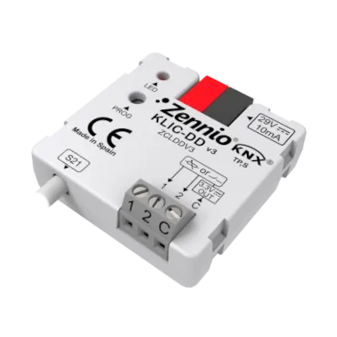

# KLIC-DD v3
<!-- markdownlint-disable MD033 -->

- ## Шлюз KNX в Daikin Residential

- REF: [KLIC-DD v3](https://knx-trade.ru/zennio-multimedia/110-zn1cl-irsc.html)

- Шлюз Zennio для двунаправленного управления бытовыми кондиционерами Daikin из системы KNX. Он включает 2 аналого-цифровых входа для датчиков температуры, датчиков движения или бинарных входов «сухой контакт» (переключатели, датчики или кнопки) и 10 логических функций.

- { width="300" loading=lazy }

## Таблица совместимости внутренних блоков Daikin с KLIC-DD v3

{{ read_csv('../assets/tables/ZCLDDV3.csv') }}

!!! Info "Внимание, смотрите отметку астериск"
    \* Для управления этими блоками необходимо установить дополнительную плату с разъемом S21. Пожалуйста, свяжитесь с вашим дилером Daikin.
    
    \** Для управления этими блоками требуется дополнительный кабель/адаптер (EKRS21) для разъема S21. Пожалуйста, свяжитесь с вашим дилером Daikin.
    
    \*** Для управления этими блоками требуется адаптер-интерфейс KRP067A41 (или KRP980B1). Его необходимо подключить к порту S403. Пожалуйста, свяжитесь с вашим дилером Daikin.

## Таблица совместимых проводных пультов

{{ read_csv('../assets/tables/ZCLDDV3.WIRED.csv') }}
