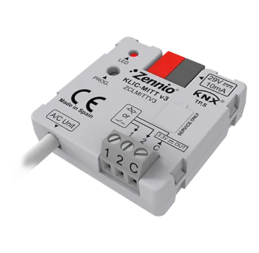

# KLIC-MITT v3
<!-- markdownlint-disable MD033 -->

- ## Шлюз KNX в Mitsubishi Electric (IT конектор)

- REF: [ZCLMITTV3](https://knx-trade.ru/zennio-climate-air-conditioner/533-zclmittv3.html)

- Шлюз **Zennio** для двунаправленного управления коммерческими и промышленными кондиционерами Daikin из системы KNX. Он включает 2 аналого-цифровых входа для датчиков температуры, датчиков движения или бинарных входов «сухой контакт» (переключатели, датчики или кнопки) и 10 логических функций. Устройство занимает 2 юнита на DIN-рейке. Аксессуары: датчик температуры и датчик движения.

- { width="300" loading=lazy }

1. Как узнать, можно ли управлять системой **Mitsubishi Electric** с помощью шлюзов **Zennio**?

1. Вы должны извлечь символы, соответствующие модели внутреннего блока. Ниже вы можете увидеть несколько примеров внутренних блоков и символов, которые соответствуют модели:

    |                 | МОДЕЛЬ      | ВНЕШНИЙ БЛОК  | ВНУТРЕННИЙ БЛОК       |      | МОДЕЛЬ ПО ТАБЛИЦЕ |
    | --------------- | ----------- | ------------- | --------------------- | ---- | ----------------- |
    | **Residential** | MSZ-SF25VE2 | MUZ-SF25VE    | **MSZ-SF**25VE2       | →    | **MSZ-SF**        |
    | **Mr. Slim**    | PLZS-35VBA  | PUHZ-ZRP35VKA | **PLA-RP**35BA        | →    | **PLA-RP**        |
    | **City Multi**  |             |               | **PEFY-P**40**VMH-E** | →    | **PEFY-P-VMH-E**  |

1. Найдите эту модель в таблице совместимости ниже и проверьте, совместима ли она с **KLIC-MITT v3**.

!!! Info "Внимание"
    - Если модель внутреннего блока **Mitsubishi Electric** отсутствует в этом списке, пожалуйста, свяжитесь с технической поддержкой Zennio.
    - Важно: указанная ниже совместимость возможна только с внутренними блоками, произведенными с 2014 года. Для внутренних блоков, произведённых до 2014 года, пожалуйста, свяжитесь с технической поддержкой **Zennio**.

## Таблица совместимости внутренних блоков Mitsubishi Electric с KLIC-MITT v3

- Редакция 9

{{ read_csv('../assets/tables/ZCLMITTV3.csv') }}
