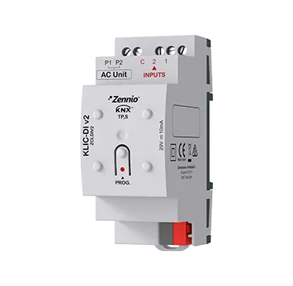

# KLIC-DA v2

<!-- markdownlint-disable MD033 -->

- ## Шлюз KNX-Daikin Altherma

- REF: [ZCLDAV2](https://knx-trade.ru/zennio-climate-aerothermy/121-zcldav2.html)

- Шлюз **Zennio** для двунаправленного управления устройствами **Daikin Altherma/Altherma 3** из системы **KNX** (см. таблицу совместимости **KLIC-DA v2**).
    * Включает 2 аналого-цифровых входа для датчиков температуры, датчиков движения или бинарных входов «сухой контакт» (переключатели, датчики или кнопки).
    * Имеет 10 логических функций.
    * Монтируется на DIN-рейку, занимает 2 юнита.
        Аксессуары: температурный датчик и датчик движения.

- { width="300" loading=lazy }

## Таблица совместимости с KLIC-DA v2

{{ read_csv('../assets/tables/ZCLDAV2.COMPATIBLE.csv') }}

## Таблица устройств, подлежащих проверке

{{ read_csv('../assets/tables/ZCLDAV2.CHECK.csv') }}

!!! Note "ПРИМЕЧАНИЕ:"
    Эти высокотемпературные блоки Altherma 3 не указаны ни как совместимые, ни как несовместимые.

    Для получения дальнейших инструкций, пожалуйста, свяжитесь с технической поддержкой Zennio по адресу support@zennio.com.

## Таблица несовместимых устройств

{{ read_csv('../assets/tables/ZCLDAV2.NOT-COMPATIBLE.csv') }}

