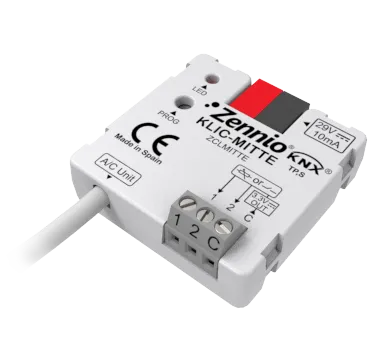

# KLIC-MITTE

<!-- markdownlint-disable MD033 -->

- ## Шлюз KNX-Mitsubishi Electric Ecodan (разъём IT)

- REF: [ZCLMITTE](https://knx-trade.ru/zennio-climate-aerothermy/717-zclmitte.html)

- Шлюз **Zennio** для двунаправленного управления гидромодулями **Mitsubishi Ecodan** через разъём **IT** из системы **KNX**.
    * Включает 2 аналого-цифровых входа для датчиков температуры, датчиков движения или бинарных входов «сухой контакт» (переключатели, датчики или кнопки).
    * Имеет 10 логических функций.

- { width="300" loading=lazy }

## Таблица соответствия KLIC-MITTE

{{ read_csv('../assets/tables/ZCLMITTE.csv') }}
