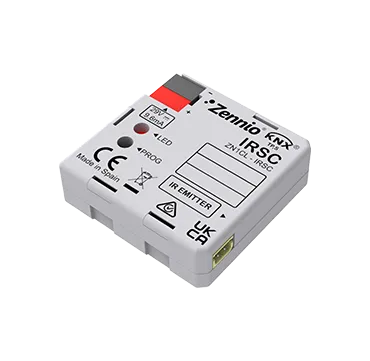

# IRSC PLUS

<!-- markdownlint-disable MD033 -->

- ## Устройство управления кондиционером

- REF: [ZN1CL-IRSC](https://knx-trade.ru/zennio-multimedia/110-zn1cl-irsc.html)

- Модуль управления кондиционером. IRSC - это инфракрасный контроллер кондиционера KNX, способный управлять более чем 300 моделями кондиционеров от разных производителей. ИК-передатчик в комплекте.

- { width="300" loading=lazy }

??? Info "Примечание"
    Модуль управления кондиционером IRSC PLUS имеет две различные аппликации. Используя таблицу совместимости обращайте внимание на номер версии в последней колонке.

      - [IRSC Plus 6.13 - ETS5/ETS6](https://www.zennio.com/documents/application_program_irsc_plus_6.13_ets5)
      - [IRSC Plus 8.3 - ETS5/ETS6](https://www.zennio.com/documents/application_program_irsc_plus_8.3_ets5)
      - [Таблица совместимости в PDF](https://www.zennio.com/documents/technical_note_irsc_plus_correspondences)

## Таблица соответствия IRSC PLUS и Пультов управления

{{ read_csv('../assets/tables/ZN1CL-IRSC.csv') }}
